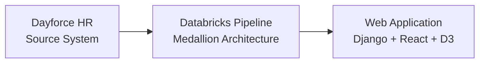
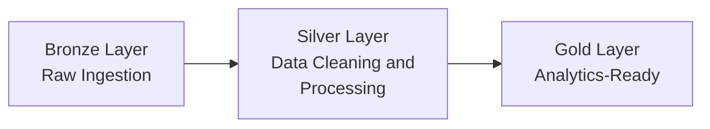

# End-to-End Data Engineering Solution for HR Analytics

Repository created for the course CSIS4495-050: Applied Research Project for the period of Fall 2025 at Douglas College.

## Project Overview

This project builds an end-to-end pipeline to preserve and analyze historical HR data from Dayforce. It snapshots daily extracts, applies SCD-2 to track changes over time, organizes data via the Medallion (Bronze/Silver/Gold) architecture, and exposes curated datasets to a lightweight Django + React app for interactive insights (headcount trends, transfers, payroll history).

---

## Project Architecture

- General Architecture


- Inside Databricks



---

## Technologies
- **Data Platform:** Databricks (Python, PySpark), Delta Lake
- **Data Design:** Medallion architecture, Kimball dimensional modeling, SCD-2
- **Backend:** Django (REST API, CSV/Delta ingestion)
- **Frontend:** React + D3 (interactive charts)
- **DevOps:** Git, notebooks, scripts

---

## Folder Structure

```
.
├── Documents/
│   └── Progress Reports.pdf
├── Implementation/
│   ├── databricks/
│   │   ├── notebooks/
│   │   └── pipeline/
│   ├── data/
│   │   ├── bronze/
│   │   ├── silver/
│   │   └── gold/
│   ├── webapp/
│   │   ├── backend/
│   │   └── frontend/
│   └── misc/
│       └── presentation.ppt

```

---

## Group Information

- Bruno do Nascimento Beserra   | 300392300 | donascimentobeb@student.douglascollege.ca
- Jay Clark Bermudez 		    | 300380540 | bermudezj@student.douglascollege.ca
- Matheus Filipe Figueiredo 	| 300389657 | figueiredom@student.douglascollege.ca
